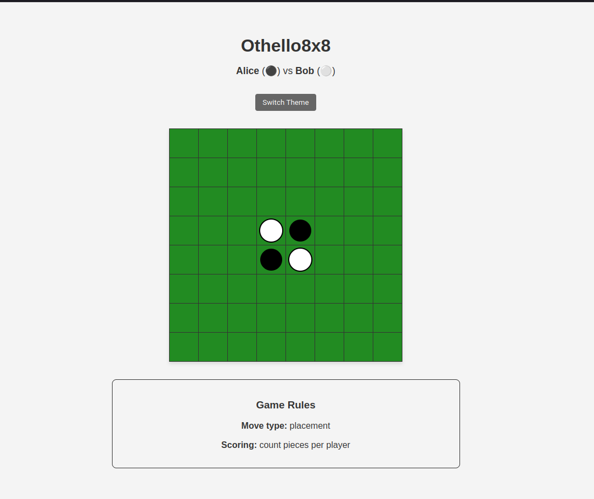

# DSL-Project

## TP1

### Sous-domaine : Jeux de plateau à information parfaite
Périmètre : Définition et paramétrisation de jeux à tour de rôle en 1 vs 1, sans hasard ni information cachée (ex : Othello, Dames, Go simplifié).

Règles du jeu Othello :
Le jeu se joue sur un plateau de 8x8 cases. Deux joueurs, un avec des pions noirs et un avec des pions blancs, s'affrontent.

Le DSL permettra de :

Définir la taille et la forme du plateau (ex : 8x8, hexagonal, rectangulaire).

Décrire les règles de capture (encadrement, inversion, élimination).

Configurer les conditions de victoire (majorité, élimination, domination).

Gérer la séquence des tours et les contraintes de validité des coups.

Le but du langage est d’offrir un moyen concis d’expérimenter des variantes de jeux parfaits comme Othello, en permettant une génération automatique du moteur de règles.

Placement initial : Au début de la partie, quatre pions sont placés au centre du plateau, deux noirs et deux blancs, en diagonale :
<br>
B N
<br>
N B

Déroulement du jeu : Les joueurs placent à tour de rôle un pion de leur couleur sur une case vide du plateau. Le but est de "capturer" les pions adverses.

Capture des pions : Pour capturer des pions, le joueur doit placer son pion de manière à encadrer un ou plusieurs pions adverses entre son nouveau pion et un autre pion de sa couleur déjà présent sur le plateau. Les pions adverses ainsi encadrés sont alors retournés et changent de couleur, devenant de la couleur du joueur qui vient de jouer.
Les captures peuvent se faire horizontalement, verticalement ou en diagonale.
Un joueur doit obligatoirement capturer au moins un pion adverse à chaque coup. S'il ne peut pas faire de capture, il passe son tour.

Fin de la partie : La partie se termine lorsque :
Le plateau est entièrement rempli de pions.
Aucun des deux joueurs ne peut effectuer de mouvement valide (c'est-à-dire qu'aucun ne peut capturer de pions).

Décompte des points : Le joueur qui a le plus de pions de sa couleur sur le plateau à la fin de la partie est déclaré vainqueur.
L’état et l’objectif varient selon les variantes/contraintes


### Notre grammaire (Langium)

Fichier .langium

```langium
grammar OthelloDsl

entry Game:
    'game' name=ID '{'
        (compileTime=CompileTimeBlock)?
        (runTime=RunTimeBlock)?
        (ui=UIBlock)?
        board=Board
        players=Players
        initial=Initial
        position=Position
        rules=Rules
    '}'
;

// ----- COMPILE-TIME -----

CompileTimeBlock:
    'compile-time' '{'
        parameters+=CTParameter*
    '}'
;

CTParameter:
    name=ID '=' value=CTValue
;

CTValue returns string:
    INT | STRING | BOOLEAN | ID
;

terminal BOOLEAN: /true|false/;

// ----- RUN-TIME -----

RunTimeBlock:
    'run-time' '{'
        parameters+=RTParameter*
    '}'
;

RTParameter:
    name=ID '=' value=RTValue
;

RTValue returns string:
    INT | STRING | BOOLEAN
;

// ----- UI / SKIN -----

UIBlock:
    'ui' '{'
        (theme=ThemeBlock)?
        (layout=LayoutBlock)?
    '}'
;

ThemeBlock:
    'theme' '{'
        'name' '=' name=STRING
        ('sprites' '{' sprites+=SpriteDef* '}')?
    '}'
;

SpriteDef:
    name=ID '=' path=STRING
;

LayoutBlock:
    'layout' '{'
        ('grid' '{' rows=INT 'x' columns=INT '}')?
        ('hands' '{' left=ID? right=ID? '}')?
        ('scaling' '=' (INT | STRING))?
    '}'
;

// ----- EXISTANT -----

Board:
    'board' rows=INT 'x' columns=INT 
;

Players:
    'players' '{'
        black=Player
        white=Player
    '}'
;

Player:
    color=('black' | 'white') name=ID
;

Initial:
    'initial' '{'
        cells+=CellAssign*
    '}'
;

CellAssign:
    'cell' position=Position '=' color=('black' | 'white')
;

Position:
    'position' '(' row=INT ',' column=INT ')'
;

Rules:
    'rules' '{'
        move=MoveRule
        end=EndRule
        scoring=ScoringRule
    '}'
;

MoveRule:
    'move' '{'
        ('type' type=('placement' | 'pass'))?
        'valid' 'if' condition=ConditionExpr
        'effect' effect=EffectExpr
    '}'
;

ConditionExpr:
    name='captures_in_any_direction' '(' 'r' ',' 'c' ')'
;

EffectExpr returns string:
    'flip_captured_pieces' '(' 'r' ',' 'c' ')'
;

EndRule:
    'end' 'when' condition=ConditionExpr
;

ScoringRule returns string:
    'scoring' 'count_pieces_per_player'
;

// ----- TERMINALS -----

hidden terminal WS: /\s+/;
terminal ID: /[_a-zA-Z][\w_]*/;
terminal INT returns number: /[0-9]+/;
terminal STRING: /"(\\.|[^"\\])*"|'(\\.|[^'\\])*'/;

hidden terminal ML_COMMENT: /\/\*[\s\S]*?\*\//;
hidden terminal SL_COMMENT: /\/\/[^\n\r]*/;
```
Exemples de .dsl

```dsl
game Othello8x8 {

    compile-time {
        boardType = "square"
        scoreGoal = "max"
        allowDiagonal = true
        initialPosition = "static"
    }

    run-time {
        Gtheme = "dark"
        showHints = true
        timer = 30
        allowUndo = false
        soundEnabled = true
    }

    ui {
        theme {
            name = "dark"
        }
    }

    board 8 x 8

    players {
        black Alice
        white Bob
    }

    initial {
        cell position(4,4) = white
        cell position(5,5) = white
        cell position(4,5) = black
        cell position(5,4) = black
    }

    position (1,1)

    rules {
        move {
            type placement
            valid if captures_in_any_direction(r,c)
            effect flip_captured_pieces(r,c)
        }
        end when captures_in_any_direction(r,c)
        scoring count_pieces_per_player
    }
}
```


### Métamodèle UML (PlantUML)

```PlantUML
@startuml
title OthelloDsl — diagramme de classes (structure de la grammaire)

' Classes principales
class Game {
  + name : ID
  + compileTime : CompileTimeBlock [0..1]
  + runTime : RunTimeBlock [0..1]
  + ui : UIBlock [0..1]
  + board : Board
  + players : Players
  + initial : Initial
  + position : Position
  + rules : Rules
}

class CompileTimeBlock {
  + parameters : CTParameter [0..*]
}
class CTParameter {
  + name : ID
  + value : CTValue
}
class CTValue {
  + INT | STRING | BOOLEAN | ID
}

class RunTimeBlock {
  + parameters : RTParameter [0..*]
}
class RTParameter {
  + name : ID
  + value : RTValue
}
class RTValue {
  + INT | STRING | BOOLEAN
}

class UIBlock {
  + theme : ThemeBlock [0..1]
  + layout : LayoutBlock [0..1]
}
class ThemeBlock {
  + name : STRING
  + sprites : SpriteDef [0..*]
}
class SpriteDef {
  + name : ID
  + path : STRING
}
class LayoutBlock {
  + gridRows : INT [0..1]
  + gridCols : INT [0..1]
  + leftHand : ID [0..1]
  + rightHand : ID [0..1]
  + scaling : (INT | STRING) [0..1]
}

class Board {
  + rows : INT
  + columns : INT
}

class Players {
  + black : Player
  + white : Player
}
class Player {
  + color : ('black'|'white')
  + name : ID
}

class Initial {
  + cells : CellAssign [0..*]
}
class CellAssign {
  + position : Position
  + color : ('black'|'white')
}

class Position {
  + row : INT
  + column : INT
}

class Rules {
  + move : MoveRule
  + end : EndRule
  + scoring : ScoringRule
}
class MoveRule {
  + type : ('placement'|'pass') [0..1]
  + condition : ConditionExpr
  + effect : EffectExpr
}
class ConditionExpr {
  + name : captures_in_any_direction(r,c)
}
class EffectExpr {
  + name : flip_captured_pieces(r,c)
}
class EndRule {
  + condition : ConditionExpr
}
class ScoringRule {
  + kind : count_pieces_per_player
}

' Associations / compositions
Game "1" *-- "0..1" CompileTimeBlock
Game "1" *-- "0..1" RunTimeBlock
Game "1" *-- "0..1" UIBlock
Game "1" *-- "1" Board
Game "1" *-- "1" Players
Game "1" *-- "1" Initial
Game "1" *-- "1" Position
Game "1" *-- "1" Rules

CompileTimeBlock "1" *-- "*" CTParameter
CTParameter "1" *-- "1" CTValue

RunTimeBlock "1" *-- "*" RTParameter
RTParameter "1" *-- "1" RTValue

ThemeBlock "1" *-- "*" SpriteDef
Initial "1" *-- "*" CellAssign
CellAssign "1" --> "1" Position

Players "1" *-- "2" Player : roles (black, white)

Rules "1" *-- "1" MoveRule
Rules "1" *-- "1" EndRule
Rules "1" *-- "1" ScoringRule

MoveRule "1" --> "1" ConditionExpr
MoveRule "1" --> "1" EffectExpr
EndRule "1" --> "1" ConditionExpr

skinparam classAttributeIconSize 0
@enduml
```

Mini-instances:<br>
1 - Othello (8x8, sandwich capture, most_tokens)<br>
2 - MiniOthello (4x4, no mandatory capture, most_tokens)

### Questions ouvertes

Quelle serait la meilleure représentation du plateau (matrice, graphes, coordonnées) pour la génération automatique ?

Comment gérer les conditions d’arrêt multiples (ex : pas de coup possible + plateau plein) ?

Quelle granularité de variabilité à l’exécution est réaliste (paramètres modifiables sans rechargement complet du jeu) ?

Faut-il prévoir une interopérabilité avec d’autres DSLs (ex : GDL, OpenSpiel) pour faciliter les comparaisons ?


## TP2

L’objectif du TP2 est de passer de la modélisation abstraite (métamodèle) à une syntaxe concrète opérationnelle à l’aide du framework Langium.

Notre DSL permet de décrire des jeux de plateau à information parfaite — et plus particulièrement le jeu Othello — tout en intégrant :

* des paramètres compile-time (CT) et run-time (RT),<br>
* une variabilité dans les règles et la structure du jeu,<br>
* et une description de l’apparence (UI / skin) directement dans le .dsl.

### Génération

Installation

```bash
npm install
```

Génération et build du langage

```bash
npm run langium:generate
npm run build
```

Ces commandes:
* génèrent les fichiers nécessaires à Langium,<br>
* compilent le projet TypeScript,<br>
* préparent l’éditeur pour l’ouverture de fichiers .dsl.


Exécution et exploration

Les fichiers d’exemple se trouvent dans le dossier :

```bash
examples/
```

Chaque sous-dossier correspond à une variante d’un même jeu Othello.

### Variantes

Les notes relatifs à la variabilité du projet se trouve dans:
```bash
/docs/variability.md
```

De plus, les variantes sont disponibles dans le dossier:
```bash
/examples
```

### Validation

Les tests de validation (variabilité/contraintes/skin) se trouvent dans:
```bash
/lang/othello-langium/packages/language/src/othello-validator.ts
```

### Preview

La preview de la variante 1 de notre projet se trouve dans le dossier suivant:
```bash
/lang/othello-langium/examples/variant1/preview
```

## TP3

L'objectif du TP3 est de passer de la variante d'un jeu spécifiée dans notre DSL à une interface (pour le moment statique) textuelle out graphique générée automatiquement.

### Grammar Langium

Notre grammaire est disponible à deux endroits différents dans notre projet (comporant le même contenu):
```bash
/lang/othello-langium/packages/language/src/othello.langium
```

### CLI

La partie CLI et les fichiers qui lui sont associés sont situés dans le dossier:
```bash
/lang/othello-langium/packages/cli
```

De plus, les fichiers permettant de générer les rendu HTML et ascii se situe dans le dossier:
```bash
/lang/othello-langium/packages/backends
```
Voici un exemple du rendu HTML généré pour la variante 1:




Les commandes utilisées pour la génération des rendus HTMLs et ascii sont les suivantes:
```bash
DSL-Project/lang/othello-langium$ npx tsc (pour compiler les fichiers .ts en .js)

DSL-Project/lang/othello-langium$ npm run test
```

### Tests

Les fichiers de test se situent dans le dossier:
```bash
/lang/othello-langium/packages/language/test
```
