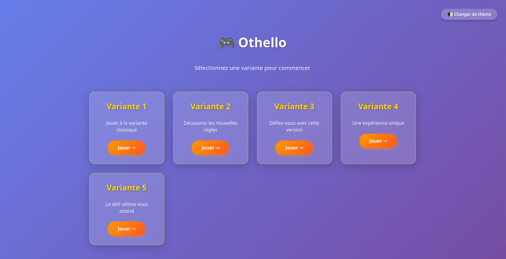
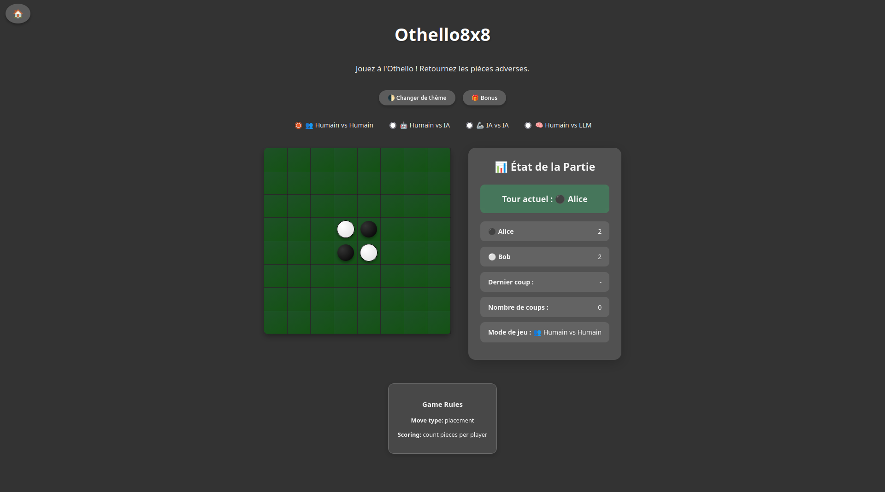
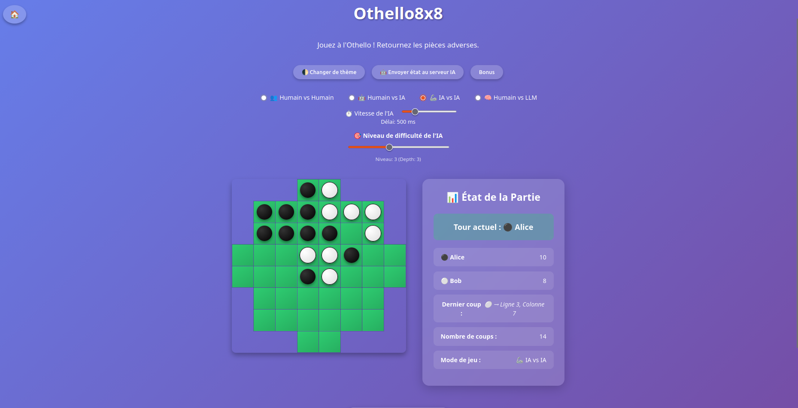

# DSL OTHELLO

## 1 - Project Overview

This project is a Domain-Specific Language (DSL) built with **Langium** for specifying and generating Othello-like games and their associated AI players. It supports multiple board topologies, several gameplay variants, and different play modes ranging from human-only matches to AI- and LLM-driven games. The system can be executed either visually (HTML/JS frontend). A strong emphasis is put on combining classical algorithmic AI with modern LLM-based agents. Overall, the project showcases language engineering, game modeling, and AI integration within a single framework.

**Figure 1:** Home

**Figure 2:** Variant 1

**Figure 3:** Variant 5


---

## 2 - Representative DSL Programs

Below are representative DSL snippets illustrating how games and variants are defined.

```dsl
# Example 1: Standard 8x8 Othello game
board 8x8
initial {
  cells {
    (4,4) white
    (4,5) black
    (5,4) black
    (5,5) white
  }
}
rules {
  move: placement
  scoring: count_pieces
}
```

**Explanation:** Defines a classic 8×8 Othello board with the standard initial configuration and scoring based on the number of discs.

```dsl
# Example 2: Custom circular board
board circle radius 4
initial {
  cells {
    (2,3) black
    (3,4) white
  }
}
```

**Explanation:** Defines a circular board variant where only the cells inside the given radius are playable, demonstrating non-rectangular board support.

---

## 3 - How to Run

### 3.1 Installation

```bash
cd lang/othello-langium/
npm install
```

### 3.2 Generate and Build

```bash
npm run langium:generate
npm run build
npm run test
```

Running the tests also generates all predefined variants in the `examples/` directory.

### 3.3 Play the Game

```bash
python3 packages/backends/server/server.py
```

Open the provided URL in a browser to access the UI. From there you can run:

* Human vs Human
* Human vs AI (Minimax)
* AI vs AI (Minimax vs Minimax)
* Human vs LLM (GPT‑4o)
* LLM vs AI / LLM vs LLM (experimental)


### 3.4 Environment Variables

* **OPENROUTER_API_KEY**: required for LLM integration. Must be defined in a `.env` file at the root of `lang/othello-langium/`.

---

## 4 - Grammar & Metamodel

The DSL grammar and metamodel define boards, rules, initial states, and variants.
You can find our grammar and metamodel (class diagram) below : 

* Grammar
```bash
./lang/othello-langium/packages/language/src/othello.langium
```

* Metamodel
```bash
./model/metamodel.puml
```

The PlantUML file provides a class diagram describing the core concepts (Board, Cell, Rule, Game, Variant) and their relationships.

---

## 5 - AIs (Rule-based / Heuristic / LLM)

### 5.1 Minimax (Algorithmic AI)

* **Implementation:** Standard Minimax with alpha-beta pruning and fixed depth.
* **Strengths:** Deterministic, rules-compliant, strong short-horizon play.
* **Weaknesses:** Horizon effect, predictable behavior, exponential cost with depth.
* **Known failure modes:** Poor long-term planning when depth is too limited; evaluation-function bias.

### 5.2 LLM Agent (GPT-4o via OpenRouter)

* **Implementation:** Sends an ASCII representation of the board and legal moves to the LLM.
* **Strengths:** Natural-language explanations, high-level strategic intuition.
* **Weaknesses:** Slower, token cost, non-deterministic.
* **Known failure modes:** May hallucinate illegal moves or misinterpret board coordinates.

### 5.3 AI Depth Limitation and In-depth Reflection

#### 5.3.1 Depth Limitation

- **Design choice:** the search depth is capped at 6 to avoid excessive response times (exponential tree growth, increased memory usage for transposition tables). This value represents a practical compromise: it allows meaningful strategic play while keeping the game responsive.
- **Observed behavior:** higher depth generally improves move quality through brute-force search, but latency increases sharply. On modest hardware, depths greater than 6 can make the AI unusable in interactive modes.

#### 5.3.2 In-depth Reflection: AI and Othello

- **Finite game:** Othello on an 8×8 board is a **finite game**. The number of possible states is bounded (each cell has a finite number of states), and every game necessarily ends when no legal moves remain or the board is full. In theory, the entire game tree could be explored, and a *perfect strategy* exists that fixes the outcome if both players play optimally. In practice, this exhaustive computation is limited by combinatorial explosion.

- **Practical complexity:** although finite, the state space and move tree are extremely large. Complexity depends mainly on the branching factor (average number of legal moves) and remaining depth (number of moves until the end). Classical techniques such as alpha-beta pruning, transposition tables, heuristic evaluation functions, move ordering, and iterative deepening significantly reduce the effective search space.

- **Endgame and tablebases:** in the final phase of the game (few moves remaining), it becomes feasible to compute the exact outcome at a reasonable cost. This is the idea behind *endgame tablebases*. Strong Othello engines typically combine heuristics for opening/midgame play with near-exhaustive or exhaustive search in the endgame.

- **Implications for this project:** for the standard 8×8 board, a competitive AI can be built using:

  - a well-designed evaluation function (corners, stable discs, mobility, parity, edge safety),
  - alpha-beta pruning with move ordering and transposition tables,
  - a limited search depth suitable for real-time interaction,
  - optionally, a hybrid approach where an LLM provides explanations while Minimax ensures correctness and execution.

- **LLM vs Minimax:** LLMs excel at producing natural-language explanations and intuitive reasoning, but they do not guarantee rule compliance and may suggest illegal moves. Minimax remains the formal backbone that guarantees legality and short-horizon optimality.


---

## 6 - LLM Protocol

### 6.1 Input Context

* System prompt: *"You are an expert Othello player…"*
* Board state: ASCII grid
* Legal moves: explicit list of allowed coordinates

### 6.2 Output JSON Schema

```json
{
  "reasoning": "Placing here flips the diagonal line…",
  "move": "C3"
}
```


### 6.3 Repair Policy

All moves proposed by the LLM are validated by the rules engine:

* If the move is legal → applied.
* If illegal → rejected and either re-requested from the LLM or replaced by a Minimax move (hybrid fallback).

### 6.4 Reproducibility Parameters

* Model: `openai/gpt-4o`
* Temperature: `0.2`
* Max tokens: configurable
* Seed: optional (used for testing)

All interactions are logged in `packages/backends/llm/data/eval/logs/`.

---

## 7 - Mini-Evaluation

Two representative variants are evaluated:

* **Classic 8×8 board**
* **Circular 8×8 board**


| Variant      | Mode         | Depth / Model         | Result                                                                    |
| ------------ | ------------ | --------------------- | ------------------------------------------------------------------------- |
| 8×8 Classic  | AI vs AI     | Minimax d=4 vs d=6    | The deeper AI (d=6) consistently wins, showing clear strategic advantage  |
| 8×8 Classic  | AI vs AI     | Minimax d=1 vs d=6    | Large skill gap: d=6 dominates almost every game                          |
| 8×8 Classic  | Human vs AI  | Human vs Minimax d=4  | AI usually wins against non-expert players                                |
| 8×8 Classic  | Human vs AI  | Human vs Minimax d=6  | AI strongly dominates; difficult for humans to compete                    |
| 8×8 Classic  | AI vs LLM    | Minimax d=4 vs GPT-4o | GPT-4o often outperforms Minimax thanks to higher-level strategic choices |
| 8×8 Classic  | AI vs LLM    | Minimax d=6 vs GPT-4o | GPT-4o still wins several games despite occasional illegal move attempts  |
| Circular 8×8 | Human vs LLM | GPT-4o                | Engaging gameplay with clear explanations; some illegal moves proposed    |
| Circular 8×8 | Human vs AI  | Human vs Minimax d=4  | Balanced games; board geometry increases human chances                    |
| Circular 8×8 | AI vs AI     | Minimax d=4 vs d=6    | d=6 still wins, but with reduced margin due to board irregularity         |

**Observation:** during our experiments, the fact that the LLM (GPT-4o) was able to defeat Minimax-based AIs, even at higher depths (d=6) was unexpected. This highlights the potential of LLMs to capture global, long-term strategic patterns that are sometimes missed by depth-limited search algorithms, despite their lack of formal guarantees.

**Reproduction:** run the backend server and select the corresponding variant and mode from the UI.

---

## 8 - Unsupported Features / Limitations

* Board shapes beyond square and circle are not supported.
* No multi-player (>2 players) support.
* LLM agents can propose illegal moves.
* Only standard "no moves left" or "board full" conditions are robustly supported.
* LLM latency (2–5s) disrupts fast-paced gameplay.

---

## 9 - Lessons Learned

* Langium simplifies DSL parsing and validation.
* LLM integration requires careful move validation.
* Designing a mapping between logical board and DOM is critical for non-rectangular boards.
* Separating the Model (DSL) from the View (HTML) and Controller (Python) was crucial. It allowed us to change the backend logic without rewriting the parser.

---

## 10 - Resources


Additional resources for the project, including documentation, notes, and previous READMEs (previous practical works), are also available below.

```bash
./old-readme/README.md
./docs/metamodel-vs-ast.md
./docs/services-notes.md
./docs/state-of-the-art.md
./docs/variability.md
```

---

## Author

**Corentin Mahieu** – [@Fir3n0x](https://github.com/Fir3n0x)

**Tom Lafay** – [@TomLafay ](https://github.com/TomLafay )

**Kelian Ninet** – [@S0nju](https://github.com/S0nju)

**Thibault Dufourcq** – [@costelo64](https://github.com/costelo64)